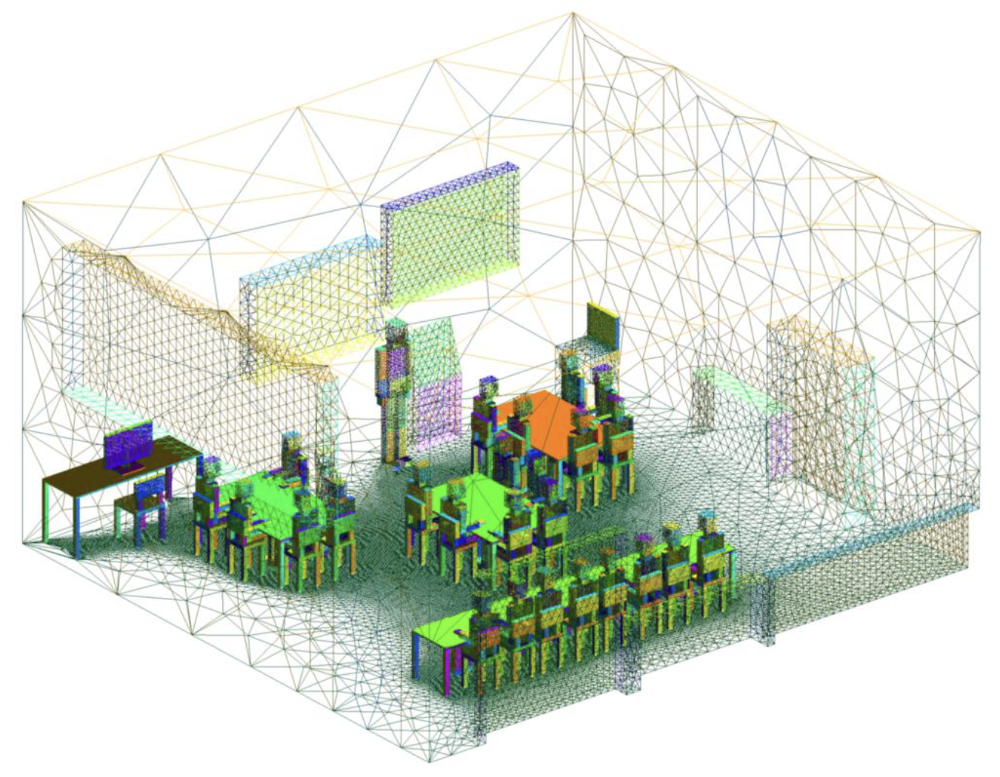
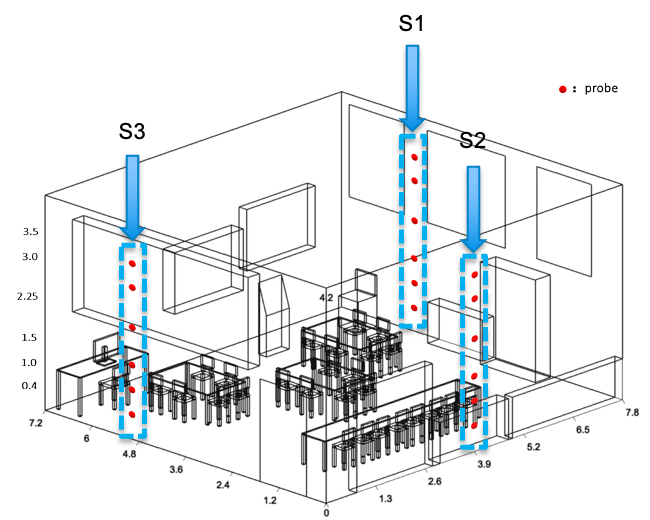

# IRP

<details open="open">
  <summary><h2 style="display: inline-block">Table of Contents</h2></summary>
  <ol>
    <li>
      <a href="#about-the-project">About The Project</a>
      <ul>
        <li><a href="#the-data">The data</a></li>
      </ul>
    <li>
      <a href="#getting-started">Getting Started</a>
      <ul>
        <li><a href="#prerequisites">Prerequisites</a></li>
        <li><a href="#installation">Installation</a></li>
      </ul>
    <li>
      <a href="#user-instructions">User Instructions</a>
      <ul>
        <li><a href="#notebooks">Notebooks</a></li>
        <li><a href="#scripts">Scripts</a></li>
      </ul>
    <li>
      <a href="#documentation">Documentation</a>
    </li>
    <li><a href="#contact">Contact</a></li>
    <li><a href="#acknowledgements">Acknowledgements</a></li>
    <li><a href="#license">License</a></li>
  </ol>
</details>

## About The Project

In today's ever-increasing demands on enclosed space environments, it is important to properly ventilate and minimise energy consumption. Given the conventional solution - computational fluid dynamics (CFD) with high computational consumption, this project aims to use artificial intelligence (AI) to achieve faster and more accurate simulation. Adversarial neural networks (ANNs) and 4D variational data assimilation with backpropagation (4D-Var DA) was combined to develop a more efficient prediction workflow. This project developed two types of ANNs: predictive adversarial autoencoder (PredAAE) with higher accuracy and predictive adversarial neural network (PredANN) with faster prediction. The ANNs are set within a reduced-order model (ROM) using low-dimensional proper orthogonal decomposition (POD) coefficients for the spatial distribution of the CFD simulations. And by adding ventilation parameters to the models, the workflow realised predictions under the different initial settings of the Dyson fan, and achieved the purpose of ventilation control. Furthermore, this project applied the AI method process in a real classroom scene of a primary school, realised the assimilation of the real experimental data, and realised the specific analysis of 8 different ventilation control cases and energy consumption of the classroom. For more detail, please refer to [dg321-final-report.pdf](https://github.com/ese-msc-2021/irp-dg321/blob/main/reports/dg321-final-report.pdf).

### The Data

The folder `data`  contains some useful data of this project including some data before training the models, some trained models, and some results after predicting. However, due to the large size, the pca models, scalers and other models need to generate by users. For example, PredAAE models can be trained easily by running  `aae_training.py` using [train_ct_all.pkl](https://github.com/ese-msc-2021/irp-dg321/blob/main/data/data%20before%20training/train_ct_all.pkl) or [train_ct_case1.pkl](https://github.com/ese-msc-2021/irp-dg321/blob/main/data/data%20before%20training/train_ct_case1.pkl) for multi-case control or case1, respectively.

#### CFD simulations

used for the main experiments of this project. The CFD model solves the Navier-Stokes equation for unsteady, incompressible and viscous flow with an advanced adaptive mesh capability, generating 54363 unstructured element nodes within the Cartesian coordinate. It was simulated for one hour, with time steps generated every 5 seconds, so a total of 720 time steps.We use the full 3D CFD data to train our model. We selected seven fields for analysis, namely: CO2 concentration, three directional components of the velocity field, temperature, humidity, and viral load. By setting different initial temperatures and speeds of the Dyson fan for CFD simulations, a total of 8 groups of data sets are obtained, of which the 8th group is the simulation without turning on the fan. For these 8 sets of data, I used the first 6 sets to train my model, the 7th set as the test set (unseen dataset), and the 8th set as the control experiment.

<div align=center></div>

#### Sensor data

records parameters relevant to air quality by 18 numerical sensors (3x6) distributed in L1, L2, and L3 three different horizontal positions. These sensor data are used for data assimilation and ventilation control analyse. It should be noted that this project involves two types of sensor data. One is the simulation data extracted from the CFD model, with 7 fields, used to conduct most of the experiments in this project. The other is the [real experimental data](https://github.com/ese-msc-2021/irp-dg321/blob/main/data/data%20before%20training/sensors/experimental_data), which contains only three fields (temperature, CO2 concentration and humidity), and is used to carry out the experiment in Section DA with only three fields.

<div align=center></div>

## Getting started

### Prerequisites

This software runs with Python 3.8. The parts related to the models are all built with Tensorflow(>=2.0).
Therefore, this software is suitable for running on devices with GPUs, including local computers with
GPUs or cloud computing services such as Colab. Since the CFD simulation data in this project are tens of GB, the equipment needs to have large storage space.

| Installation requirements and dependencies - Python 3.8, GPUs |
| ------------------------------------------------------------- |
| sklearn (0.20 or above)                                       |
| tensorflow (2.0 or above)                                     |
| numpy (1.19.1 or above)                                       |
| matplotlib (3.3.1 or above)                                   |
| os, sys, time, math, joblib                                   |
| meshio, vtk, vtktools (given in the tools)                    |

### Installation

1. Clone the repository:

```sh
$ git clone https://github.com/ese-msc-2021/irp-dg321
```

2. cd to the repository:

```sh
$ cd irp-dg321
```

3. Create a `conda` environment that fit the above requirements and dependencies
4. Run notebooks or scripts directly according to the following User Instructions.
5. If you want to make your own application, feel free to import my tools:

```sh
import sys
sys.path.append("..")
import tools as t
```

and call the functions you want.

## User Instructions

This project mainly includes two parts: scripts and notebooks. The notebooks contain the development logic and process of the entire project and are mainly used for analysis and visualisation. Among them, ``Ventilation_control.ipynb`` and ``Data_recovery_and_visualisation.ipynb`` are the main notebooks related to ventilation control in this project, which have specific usage instructions within the notebooks. The .py files in the scripts are the automatic reflection of the notebooks, which involve automatic data processing in the early stage and model training, predicting, 4D-Var DA and ventilation control. The following is a brief introduction to the files in these two folders:

### Notebooks:

* [Ventilation_control.ipynb](https://github.com/ese-msc-2021/irp-dg321/blob/main/notebooks/Ventilation_control.ipynb): shows how to conduct ventilation control experiments. It mainly includes: how to process the raw nodes, sensor, and ventilation parameter and combine them together into tensor data set which could be used to train PredAAE and PredANN model; after training the model, how to make prediction and 4D-Var for different cases. See the table of contents for a clearer understanding of the structure of this notebook.
* [Data_recovery_and_visualisation.ipynb](https://github.com/ese-msc-2021/irp-dg321/blob/main/notebooks/Data_recovery_and_visualisation.ipynb): shows how to recover the data from latent space and split them into nodes, sensors and ventilation parameters. Meanwhile, the ventilation control results can be shown by running this notebook. See the table of contents for a clearer understanding of the structure of this notebook.
* [Load_data.ipynb](https://github.com/ese-msc-2021/irp-dg321/blob/main/notebooks/Load_data.ipynb): includes the process of loading and processing the single CFD case data at the beginning of this project.
* [PredAAE_training.ipynb](https://github.com/ese-msc-2021/irp-dg321/blob/main/notebooks/PredAAE_training.ipynb): includes the development process of building, training and DA for PredAEE.
* [PredANN_training.ipynb](https://github.com/ese-msc-2021/irp-dg321/blob/main/notebooks/PredANN_training.ipynb): includes the development process of building, training and DA for PredAEE.
* [Data_assimilation_4dvar.ipynb](https://github.com/ese-msc-2021/irp-dg321/blob/main/notebooks/Data_assimilation_4dvar.ipynb): includes the development process of 4D-Var DA.

### Scripts:

The general steps for using scripts are: 1. run ``vtu_npy.py`` and ``extract_sensordata.py`` to convert vtu file to npys for CFD and sensors, respectively; 2. run ``data_standardization.py`` and ``data_compression.py`` to implement standardization and POD compression; 3. run ``aae_training.py`` or ``ann_training.py`` to train the ANNs; 4. run ``aae_predicting_multicases.py`` or ``ann_predicting_multicases.py`` to implement predictions for multiple cases; 5. run ``aae_control_case8.py`` to implement ventilation control experiments(run ``aae_control_case8_3fields.py`` for real sensor case).

* [vtu_npy.py](https://github.com/ese-msc-2021/irp-dg321/blob/main/scripts/vtu_npy.py): extract and convert vtu files to npy files for multiple fields and cases.
* [extract_sensordata.py](https://github.com/ese-msc-2021/irp-dg321/blob/main/scripts/extract_sensordata.py): extract sensor data from CFD simulations according to sensor coordinates.
* [data_standardization.py](https://github.com/ese-msc-2021/irp-dg321/blob/main/scripts/data_standardization.py): scales data set into (0, 1).
* [data_compression.py](https://github.com/ese-msc-2021/irp-dg321/blob/main/scripts/data_compression.py): compresses the nodes' data into POD coefficient.
* [aae_training.py](https://github.com/ese-msc-2021/irp-dg321/blob/main/scripts/aae_training.py): trains PredAAE.
* [aae_predicting_multicases.py](https://github.com/ese-msc-2021/irp-dg321/blob/main/scripts/aae_predicting_multicases.py): implements normal prediction and 4D-Var DA using PredAAE for multiple cases.
* [aae_control_case8.py](https://github.com/ese-msc-2021/irp-dg321/blob/main/scripts/aae_control_case8.py): implements the ventilation control using PredAAE and doing 4D-Var DA
  with all 7 fields
* [aae_control_case8_3fields.py](https://github.com/ese-msc-2021/irp-dg321/blob/main/scripts/aae_control_case8_3fields.py): implements the ventilation control using PredAAE and doing 4D-Var DA
  with only three fields that real sensors can acquire (CO2 concentration, temperature and humidity).
* [ann_training.py](https://github.com/ese-msc-2021/irp-dg321/blob/main/scripts/ann_training.py): trains PredANN.
* [ann_predicting_multicases.py](https://github.com/ese-msc-2021/irp-dg321/scripts/ann_predicting_multicases.py): implements normal prediction and 4D-Var DA using PredANN for multiple cases.

## Documentation

The main theoretical results of this project are presented in the final report ``dg321-final-report.pdf``.
In addition, there are one plan ``dg321-project-plan.pdf`` and presentation ``dg321-presentation.pdf`` about the project, respectively.

## Contact

* Donghu, Guo- donghu.guo21@imperial.ac.uk `<br>`

## Acknowledgements

Great thanks to my supervisors:

* Christopher, Pain- c.pain@imperial.ac.uk `<br>`
* Claire, Heaney- c.heaney@imperial.ac.uk `<br>`
* Boyang, Chen c.boyang@imperial.ac.uk `<br>`

Great thanks to [AMCG MSc team](https://www.imperial.ac.uk/earth-science/research/research-groups/amcg/).

Great thanks to the CO-TRACE EPSRC Covid-19 Infection Risk in schools consortium and Prof. Prashant Kumar at Surrey University for the support of this project.

## License

The scripts and documentation in this project are released under the [MIT License](https://github.com/actions/upload-artifact/blob/main/LICENSE).
